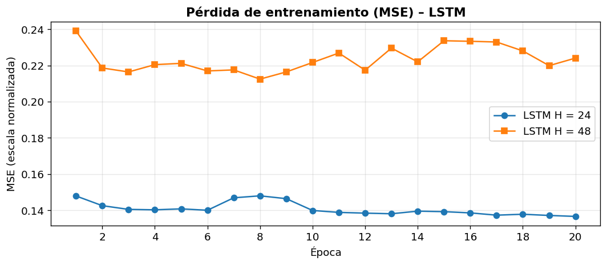
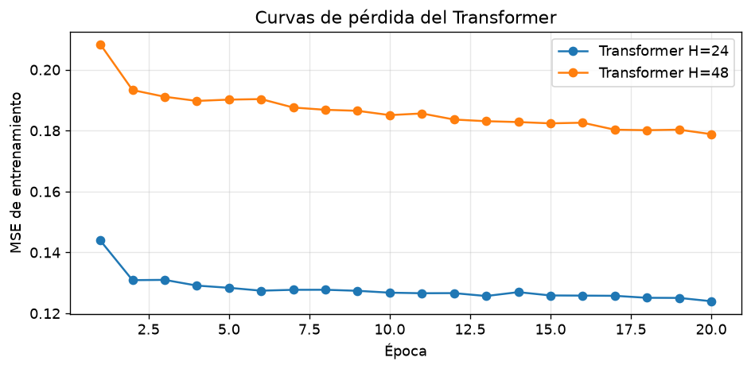
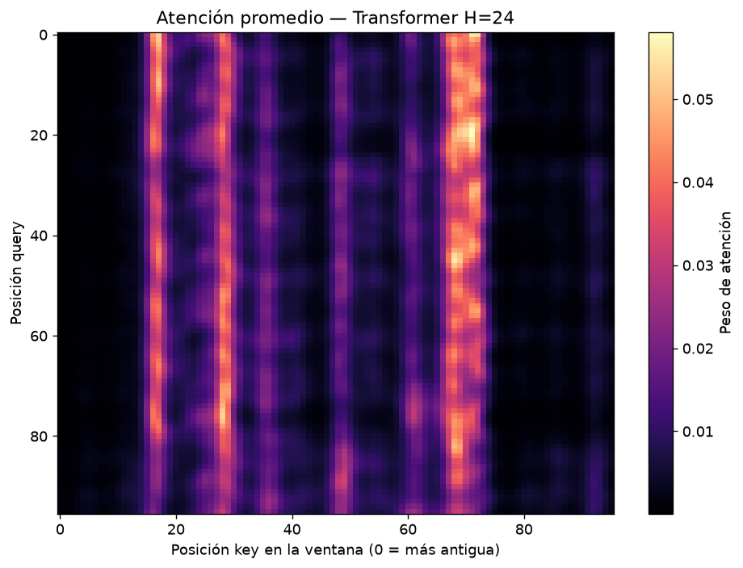
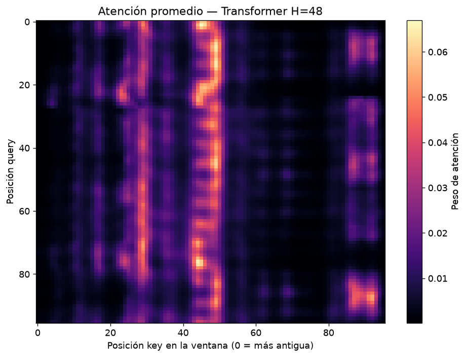

# CC3092 – Laboratorio 7: ETTh1 Forecasting

**Dataset:** ETTh1 · **variable objetivo:** `OT` · **horizontes:** 24 h y 48 h. Las métricas son de validación y están en escala normalizada. Para reproducir: `pip install -r requirements.txt` y ejecutar `Lab7_ETTh1.ipynb`.

## Task 1

La ACF presenta alta persistencia y estacionalidad diaria:

| Lag (h) | ACF |
|---:|---:|
| 0 | 1.0000 |
| 22 | 0.9262 |
| 24 | 0.9250 |
| 48 | 0.8763 |
| 96 | 0.8489 |

El mayor pico local después de cero está en 22 h, consistente con un ciclo cercano a un día. `L=96` cubre cuatro ciclos diarios y conserva señal informativa (`ρ(96)=0.8489`), equilibrando contexto y costo computacional.

## Task 2

`LSTMForecaster` implementa manualmente las compuertas LSTM y predice el cambio respecto al último valor de la ventana. Esta normalización relativa evita que el cambio de nivel entre train y validación sesgue la predicción. Se usó MSE, apropiado para errores aproximadamente gaussianos y para penalizar con mayor fuerza errores grandes.

| Modelo | Horizonte | MAE | RMSE | Ratio vs. naive |
|---|---:|---:|---:|---:|
| LSTM | 24 h | 0.1918 | 0.2592 | 0.961 |
| LSTM | 48 h | 0.2547 | 0.3243 | 0.978 |
| Naive | 24 h | 0.1996 | 0.2672 | 1.000 |
| Naive | 48 h | 0.2604 | 0.3359 | 1.000 |

## Task 3

El Transformer usa proyección escalar a `d_model=32`, positional encoding sinusoidal, self-attention de dos cabezas, FFN y LayerNorm, sin `nn.MultiheadAttention`. La atención tiene forma `(B, 2, 96, 96)` y cada fila suma uno.

### 3.3 Entrenamiento, métricas y atención

Se entrenó un `TransformerForecaster(d_model=32, n_heads=2, d_ff=64, L=96)` para cada horizonte con Adam (`lr=1e-3`), 20 épocas y `batch_size=64`.

| Modelo | Horizonte | MAE | RMSE | Ratio vs. naive |
|---|---:|---:|---:|---:|
| Transformer | 24 h | 0.1966 | 0.2527 | 0.985 |
| Transformer | 48 h | 0.2424 | 0.3017 | 0.931 |

El Transformer supera al naive en ambos horizontes. El LSTM logra menor MAE a 24 h, mientras que el Transformer mejora MAE y RMSE a 48 h.

Los mapas se calcularon con `return_attn=True` para cinco ejemplos de validación y se promediaron sobre los ejemplos y las dos cabezas; el resultado tiene forma `(96, 96)`.

| Horizonte | Lags con mayor atención desde CLS | Pesos CLS |
|---:|---|---|
| 24 h | 25, 24, 79, 80, 26 | 0.05494, 0.05428, 0.05178, 0.04583, 0.04218 |
| 48 h | 51, 50, 49, 52, 67 | 0.06028, 0.05899, 0.04975, 0.04914, 0.04702 |

Se usa `lag = 96 − posición`: lag 1 corresponde al valor más reciente y lag 96 al más antiguo.

## Task 4 – Comparación y análisis final

### 4.1) ACF frente a atención

Los picos locales principales de ACF son lag 22 (`0.92616`), lag 47 (`0.87696`) y lag 72 (`0.85716`). Para H=24, CLS se concentra en 24–26 h (máximo en lag 25, `0.05494`) y también en 79–80 h. Para H=48, el bloque dominante es 49–52 h (máximo en lag 51, `0.06028`) y aparece lag 67 (`0.04702`).

La coincidencia es aproximada: 24–25 está cerca del pico diario en 22, y 49–52 cerca del pico de dos días en 47; los bloques 79–80 y 67 están próximos, pero no exactamente sobre, el pico de 72. El Transformer no maximiza la correlación marginal: combina contenido de la ventana, posición y objetivo para minimizar la pérdida, por lo que puede desplazar la atención hacia observaciones más útiles para un régimen concreto.

La ACF mide dependencia lineal promedio entre `x_t` y `x_(t-k)`. La atención usa `softmax(QKᵀ/√d_k)`, con proyecciones aprendidas, y puede seleccionar lags distintos según el patrón de valores: por ejemplo, distinguir una subida rápida de una meseta con correlación lineal similar. Las bandas localizadas y su desplazamiento por horizonte son evidencia compatible con esa selección condicional, aunque un mapa promedio por sí solo no prueba una dependencia no lineal; haría falta análisis por ejemplo o intervenciones de entrada.

### 4.2) Resultados y efecto del horizonte

| Modelo | Horizonte | MAE | RMSE | Ratio vs. naive |
|---|---:|---:|---:|---:|
| LSTM | 24 h | 0.1918 | 0.2592 | 0.961 |
| LSTM | 48 h | 0.2547 | 0.3243 | 0.978 |
| Transformer | 24 h | 0.1966 | 0.2527 | 0.985 |
| Transformer | 48 h | 0.2424 | 0.3017 | 0.931 |
| Naive | 24 h | 0.1996 | 0.2672 | 1.000 |
| Naive | 48 h | 0.2604 | 0.3359 | 1.000 |

En una LSTM iterativa, el error se propaga aproximadamente como `e_H ≈ Σ_(j=1)^H (Π_(i=j+1)^H J_i) ε_j`, donde `J_i` es el jacobiano local y `ε_j` un error introducido en cada paso. Por ello suele crecer con el horizonte. Aquí hay un modelo directo many-to-one por horizonte, sin realimentación iterativa; aun así, a 48 h aumenta la incertidumbre condicional y disminuye la información predictiva del contexto de 96 h.

El patrón observado coincide con la hipótesis: LSTM gana a 24 h, pero Transformer gana a 48 h. En LSTM, el gradiente hacia un estado temprano contiene una cadena temporal, `∂L/∂h_t = ∂L/∂h_L Π_(i=t+1)^L ∂h_i/∂h_(i-1)`. Las compuertas pueden preservarlo, pero la cadena todavía puede atenuarlo o amplificarlo. En el Transformer, atención y residual conectan directamente posiciones distantes, facilitando el flujo del gradiente sin atravesar 96 transiciones recurrentes. Es una explicación arquitectónica plausible de la ventaja a 48 h, no una prueba causal.

